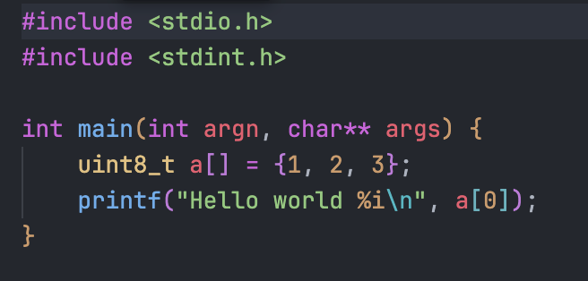
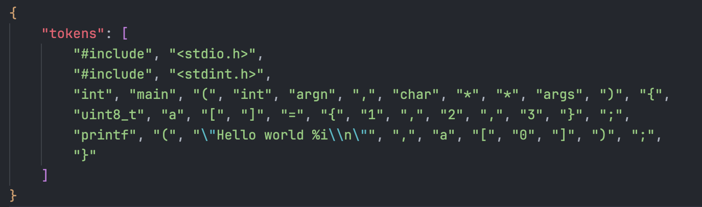

# fork-in-dt

`fork-in-dt` — это утилита на C, которая использует `difft` для парсинга кода и извлекает токены, сохраняя их в JSON-формате.

## Возможности
- Запускает `difft --dump-syntax` для анализа синтаксиса.
- Корректно обрабатывает экранированные символы.
- Токенизирует файл и сохраняет вывод в JRD формате

## Компиляция
Для сборки программы используйте GCC:
```sh
gcc fork-in-dt.c -o fork-in-dt
```

## Использование
```sh
./fork-in-dt <input_file> [output_file]
```

### Команды:
#### Вывод в консоль:
```sh
./fork-in-dt example.c
```
#### Сохранение в файл:
```sh
./fork-in-dt example.c output.json
```
## Выходной формат
Программа генерирует файл с потоком токенов в JDR формате

### Пример:

```sh
./fork-in-dt example.c output.json
```



## Тесты
Чтобы запустить тесты необходимо выполнить fork_in_dt_tests.sh

```sh
chmod +x fork_in_dt_tests.sh
./fork_in_dt_tests.sh
```

## Требования
- Установленный difft (Difftastic)
- Компилятор C (GCC/Clang)